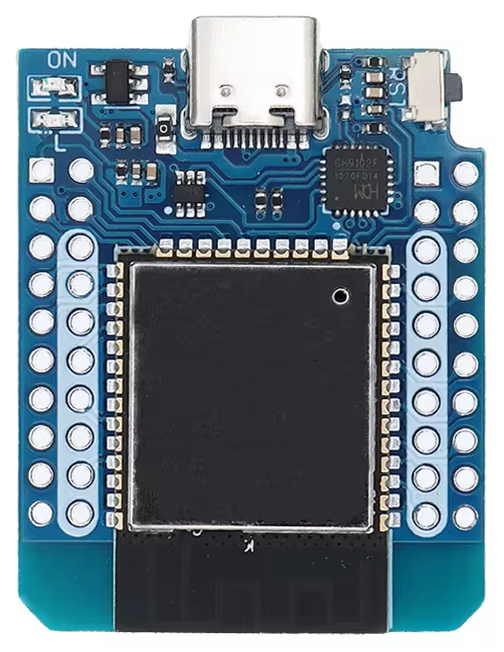
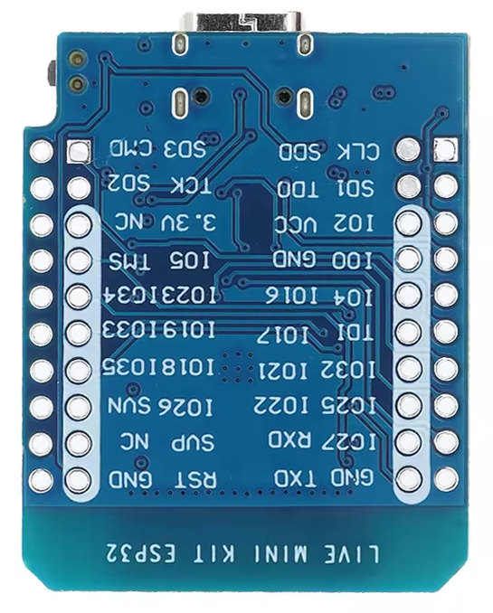
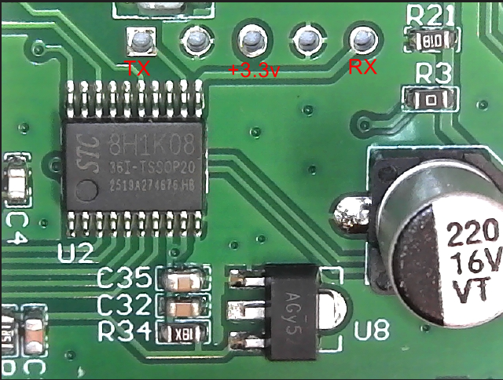

# HTZSafe Custom ESPHome Component

A custom ESPHome component for integrating wireless motion sensor receivers (commonly sold as driveway alarm systems) with Home Assistant.

Fair warning, I only have one receiver and two sensors to test this with.

## Overview

This component allows you to monitor wireless motion sensors through an ESP32 board connected to the receiver unit of a wireless driveway alarm system. Each motion sensor triggers a binary sensor in Home Assistant that automatically resets after 5 seconds.

## Hardware Requirements

### Components

1. **ESP32 D1 Mini** (or similar ESP32 board)

   | Top View | Bottom View |
   |----------|-------------|
   |  |  |

2. **Wireless Driveway Alarm Receiver** - [Driveway Alarm- 1/2 Mile Long Range](https://www.amazon.com/dp/B08NYH9JL4) (non-affiliate link)
   - Description: *"Driveway Alarm- 1/2 Mile Long Range Wireless Driveway Alarm Outdoor Weather Resistant Motion Sensor&Detector-DIY Security Alert-Monitor&Protect Outdoor/Indoor Property"*

### Wiring

Connect the receiver board to the ESP32 as follows:

| Receiver Pin | ESP32 Pin |
|--------------|-----------|
| TX           | GPIO16 (RX) |
| +5V          | VCC       |
| GND          | GND       |

**Receiver Board Pin Layout:**



**Note:** The receiver board has clearly marked pins as shown in the image above. Use the +5V pin that's marked `ABOVE` these pins, `NOT` the 3.3v pin in the image. Connect 5v to VCC on the ESP32.

## Quick Start

### Prerequisites

- Python 3.9 or newer
- ESPHome installed (`pip install esphome`)
- USB cable to connect ESP32 to your computer
- WiFi credentials

### Step-by-Step Setup

#### 1. Create Secrets File

Create a `secrets.yaml` file in the project root:

```bash
nano secrets.yaml
```

Add your credentials:

```yaml
wifi_ssid: "YourWiFiSSID"
wifi_password: "YourWiFiPassword"
fast_connect: "false"
esp_encryption_key: "your-32-character-encryption-key-here="
ap_mode_pw: "fallback-password"
```

**Note:** Generate an encryption key with: `esphome wizard dummy.yaml` (it will generate a random key you can copy)

#### 2. Edit Configuration

Edit `owl-sensor.yaml` and update the device name and friendly name if desired:

```bash
nano owl-sensor.yaml
```

For initial setup, **comment out or remove** the devices section temporarily:

```yaml
substitutions:
  device_name: owl-sensor
  device_id: owl-sensor
  friendly_name: Owl sensor
  device_description: ESP32
  icon: "mdi:motion-sensor"

esphome:
  name: "${device_name}"
  friendly_name: ${friendly_name}
  platformio_options:
    board_build.f_cpu: 80000000L  # Run at 80MHz to reduce power
  on_boot:
    priority: 600
    then:
      - lambda: |-
          // Disable brownout detector
          #include "soc/rtc_cntl_reg.h"
          #include "soc/soc.h"
          WRITE_PERI_REG(RTC_CNTL_BROWN_OUT_REG, 0);

esp32:
  board: nodemcu-32s
  framework:
    type: arduino
    # Disable brownout detector to prevent restart loops
    version: recommended
  # Reduce startup power
  variant: esp32

# Enable logging
logger:
  baud_rate: 0  # Disable UART logging to reduce startup power

# Enable Home Assistant API
api:
  encryption:
    key: !secret esp_encryption_key

ota:
 - platform: esphome

wifi:
  ssid: !secret privateCloud_wifi_ssid
  password: !secret privateCloud_wifi_password
  fast_connect: !secret fast_connect
  domain: .lan
  output_power: 8.5dB  # Reduced WiFi TX power to lower startup surge
  # fast_connect reduces WiFi connection time and startup power
  # Enable fallback hotspot (captive portal) in case wifi connection fails
  ap:
    ssid: "${device_name}"
    password: !secret ap_mode_pw

captive_portal:

external_components:
  - source: github://mutilator/htzsafe_component_esphome
    refresh: 0d # optional
    components: [htzsafe]

uart:
  - id: htzsafe_uart
    tx_pin: GPIO17
    rx_pin: GPIO16
    baud_rate: 9600

htzsafe:
  id: owl_sensor
  uart_id: htzsafe_uart
#  devices:
#    - id: driveway_sensor
#      name: "Driveway"
#      identifier: 0x1234

button:
  - platform: restart
    name: "Restart"

sensor:
  - platform: wifi_signal
    name: "WiFi signal"
    update_interval: 60s

```

#### 3. Connect ESP32

Connect your ESP32 board to your computer via USB.

#### 4. Build and Flash

First time flashing (via USB):

```bash
esphome run --device COM1 owl-sensor.yaml
```

This will:
- Compile the firmware
- Detect your connected ESP32
- Flash the firmware
- Show live logs

Select the USB port for your OS (usually `/dev/ttyUSB0` on Linux, `COM1` on Windows, or `/dev/cu.usbserial-*` on macOS).

#### 6. Identify Your Sensors

With the ESP32 running and logs visible:

1. Trigger each motion sensor one at a time
2. Watch the logs for messages like:

```
[20:15:06.905][W][htzsafe:085]: Unknown device identifier: 0x926a
```

3. Copy each identifier and add it to your configuration:

```bash
nano owl-sensor.yaml
```

Uncomment and update the devices section:

```yaml
htzsafe:
  id: owl_sensor
  uart_id: htzsafe_uart
  devices:
    - id: driveway_sensor
      name: "Driveway"
      identifier: 0x926a  # Replace with your actual identifier
    - id: mailbox_sensor
      name: "Mailbox"
      identifier: 0xe76a  # Replace with your actual identifier
```

#### 7. Update Firmware Over-The-Air (OTA)

After the initial flash, you can update wirelessly:

```bash
esphome run owl-sensor.yaml
```

Select the network option (it will show the device's IP address).

**Or compile only:**

```bash
esphome compile owl-sensor.yaml
```

#### 8. View Logs

To monitor logs without reflashing:

```bash
esphome logs owl-sensor.yaml
```

Or connect to the device directly:

```bash
esphome logs owl-sensor.yaml --device 192.168.1.xxx
```

## Manual Installation (Alternative)

If you prefer to integrate this component into an existing ESPHome setup:

### 1. Copy Component Files

Copy the `components/htzsafe` folder to your ESPHome configuration directory:

```
your-esphome-config/
├── components/
│   └── htzsafe/
│       ├── __init__.py
│       ├── htzsafe.cpp
│       └── htzsafe.h
└── your-device.yaml
```

### 2. Add to Your Configuration

Reference the example `owl-sensor.yaml` configuration and adapt it to your setup.

## Configuration Details

### Power Optimization

Due to power consumption issues, the following optimizations are included, YMMV:

- **Brownout detector disabled** - Prevents resets during power surges
- **CPU frequency reduced to 80MHz** - Lowers power consumption
- **WiFi TX power reduced to 8.5dB** - Reduces startup power surge

⚠️ **Important:** These optimizations require a strong WiFi signal. Place the ESP32 in an area with good WiFi reception to avoid connectivity issues.

### HTZSafe Component Configuration

```yaml
htzsafe:
  id: motion_receiver        # Component ID (required)
  uart_id: htzsafe_uart      # UART component ID (required)
  devices:                   # List of sensors (required)
    - id: sensor_id          # Unique ID for Home Assistant entity
      name: "Sensor Name"    # Friendly name
      identifier: 0xXXXX     # 2-byte hex identifier from logs
```

### Protocol Details

The receiver uses a simple serial protocol:

- **Baud rate:** 9600
- **Header:** `0xebaf05` (3 bytes)
- **Identifier:** 2-byte unique ID for each sensor
- **Additional Data** 4 bytes with unknown data
- **Padding for sound** Sends 0x92 while the tone is sending, we look for 10 consecutive 0x92 bytes for 2 seconds after a header is received. This keeps from seeing false positives when the devices send "pings" back to the receiver.
- **Total message:** 5 bytes

When a sensor is triggered:
1. The binary sensor turns ON immediately
2. After 5 seconds, it automatically turns OFF
3. This timeout is handled by the component itself

## Troubleshooting

### Device Not Responding

- Check wiring connections
- Verify WiFi signal strength
- Check ESPHome logs for error messages

### Unknown Device Identifier

- This is expected when setting up new sensors
- Copy the identifier from the logs
- Add it to your configuration with a descriptive name

### Frequent Reboots

- Ensure you have good WiFi signal strength
- Consider using a better power supply
- The brownout detector is already disabled

### Sensors Not Triggering

- Verify the sensor batteries are fresh
- Check the receiver LED lights up when sensor is triggered
- Confirm the identifier in your configuration matches the logs

## Example Use Cases

- Monitor driveway or gate entrances
- Mailbox notifications
- Perimeter security
- Path/walkway detection
- Wildlife detection

## Home Assistant Integration

Once configured, the sensors will automatically appear in Home Assistant as binary sensors. You can use them in automations like:

```yaml
automation:
  - alias: "Driveway Alert"
    trigger:
      - platform: state
        entity_id: binary_sensor.driveway
        to: "on"
    action:
      - service: notify.mobile_app
        data:
          message: "Motion detected in driveway"
```

## License

This component is provided as-is for personal use.

## Credits

Component developed for use with commercial wireless driveway alarm systems to integrate with Home Assistant via ESPHome.
